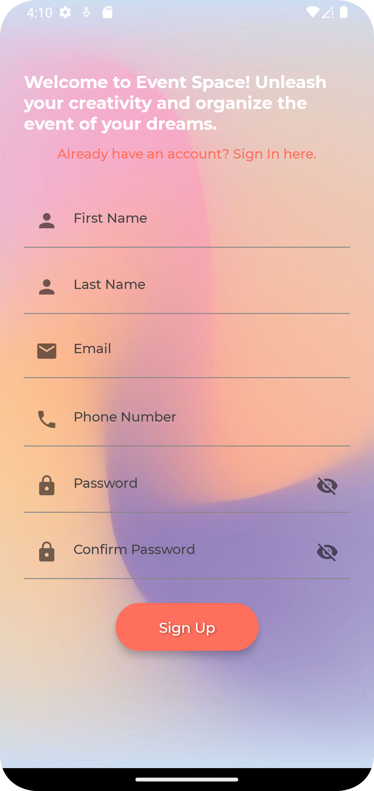
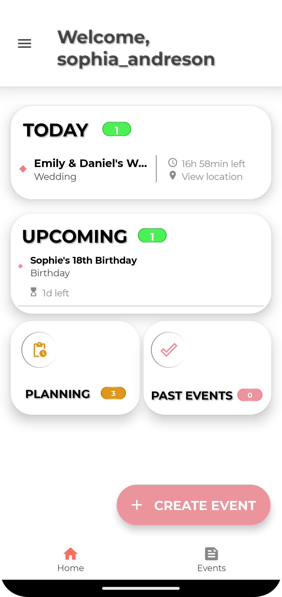
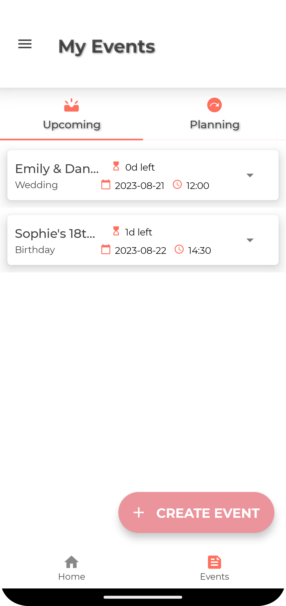
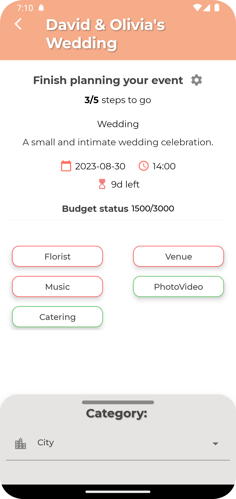
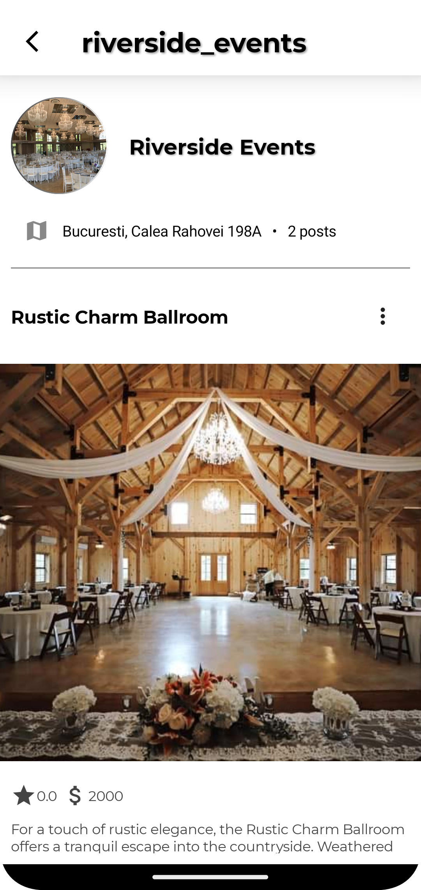

# Event Space
Event Space is an Android Mobile App dedicated to all parties invlolved in the event planning industry. It enables individuals or professionals to plan an event by choosing the desired services directly from service providers.
Moreover, it includes awesome tools for vendors to showcase their services and handle appointments in-app.

## Screenshots
### Client Flow

  
  
  
  
  
  
  

### Business Flow

  
  
  
  

